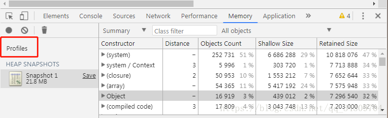
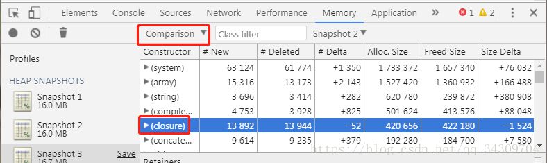

## 垃圾回收原理浅析
### 现在各大浏览器通常采用的垃圾回收方法：标记清除，引用计数

1. 标记清除
    当变量进入执行环境时，就标记这个变量为进入环境。从逻辑上将，永远不能释放进入环境的变量所占用的内存，因为只要执行进入相应的环境，就可能会用到他们，当变量离开时，则将其标记为离开和环境。
    垃圾收集器在运行的时候会给存储在内存中的，所有变量都加上标记。然后，它会去掉环境中的变量引用的标记。而在此之后再被加上标记的变量将视为准备删除的变量，原因是环境中的变量已经无法访问到这些变量了，最后，垃圾收集器完成内存清楚工作，销毁哪些带标记的值，并回收他们所占用的内存空间。
    工作流程：
    1. 垃圾回收器，在运行的时候回给存储在内存中的所有变量都加上标记
    2. 去掉环境中的变量以及环境中的变量引用的变量的标记
    3. 再被加上标记的会被视为准备删除的变量
    4. 垃圾回收器完成对内存清除工作，销毁那些带标记的值并回收他们所占用的内存。

2. 引用计数
    另一种不太常见的垃圾回收策略就是引用计数。引用计数的含义是跟踪每一个值被引用的次数。当声明了一个变量并将一个引用类赋值给该变量时，则这个值的引用次数就是1。相反，如果包含对这个值的变量又取得另外一个值，则这个值的引用次数就减1.当这个引用次数变成0时，则回收。

    IE中有部分对象并不是原生javascript对象。例如，其BOM和DOM的对象就是使用C++以COM对象的形式实现的，而COM对象的回收垃圾就是采用的引用计数的策略。因此即使IE的javascript引擎使用标记清除的策略，但javascript访问的COM对象依然基于引用计数的策略的。说白了，只要IE中设计到COM对象，就会存在循环引用的问题。看看下面的例子
    ```javascript
        var element = document.getElementById('some_element')
        var myObj = new Object()
        myObj.element = element

    ```
    工作流程：
    1. 声明一个变量并将一个引用类型的值赋值给这个变量，这个引用类型的引用次数就是1,
    2. 同一个值又被赋值给另一个变量，这个引用类型值的引用次数加1
    3. 当包含这个引用类型值的变量又被赋值成另一个值，那么这个引用类型值的引用次数减1
    4. 当引用次数编程0，说明没法访问这个值了

## 什么情况会引起内存泄漏

1. 意外的全局变量引起的内存泄漏
原因：全局变量，不会被回收
解决：使用严格模式避免

2. 闭包引起的内存泄漏
原因：闭关维护函数内部局部变量，使其得不到释放
解决：将事件处理函数定义在外部，解决比较，或者在定义事件函数的外部函数时，删除对DOM的引用

3. 没有清理的DOM元素引用
原因：虽然别的地方删除了，但是对象中还存在对DOM的引用
解决：手动删除

4. 被遗忘的定时器或者回调
原因：定时器中有DOM的的引用，及时DOM删除了，但是定时器还在，所以内存中还是有这个DOM
解决：手动删除地址器和DOM

5. 子元素存在引用引起的内存泄漏
原因： div中的Ul li得到这个DIV，会间接引用某个得到的LI，那么因此因为div间接引用li，即使li被清楚，也还是在内存中，并且只要li不被删除，他的父元素都不会被删除
解决：手动删除清空

## 什么放在内存中？什么不放在内存中
基本类型是： Undefined / Null / Boolean / Number / String
基本类型的值存在内存中，被保存在栈内存中，而从一个变量向另一个变量复制基本类型的值，会被创建这个值的副本
引用类型的值是对象，保存在堆内存中
1. 包含引用类型值的变量实际上包含的并不是对象本身，而是一个指向该对象的指针，从一个变量向另一个变量复制引用类型的值，复制的其实是指针，因此两个变量始终都指向同一个对象。

## 堆和栈的区别
1. 堆栈控件分配区别
 1. 栈：又操作系统自动分配释放，存放函数的参数值，局部变量等，其操作方式类型于数据结构中的栈
 2. 堆：一般又程序员分配释放，若程序员不释放，程序结束时可能由OS回收，分配方式类似倒是类似于链表

2. 堆栈缓存方式区别
 1. 栈使用的是一级缓存，他们通常都是被条用时处于存储空间中，调用完毕立即释放
 2. 堆是存放在二级缓存中，生命周期又虚拟机的垃圾回收算法决定。所以调用这些对象的速度要相对来得低一些。

3. 堆栈数据结构区别
 堆：堆可以被看成一棵树，如堆排序
 栈：一种先进后去的数据结构



constructor：类名
Distance：对象到根的引用层级距离
Objects Count：该类的对象数
Shallow Size：对象所占内存（不包含内部引用的其他对象所占的内存）
Retained Size：对象所占的总内存（包含····················································）



#New：新建了多少对象
#Deleted：回收了多少对象
#Delta：新建的对象个数减去回收的对象个数
重点看closure（闭包），如果#Delta为正数，则表示创建了闭包函数，如果多个快照中都没有变负数，则表示没有销毁闭包