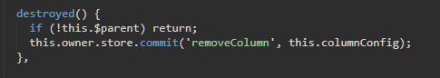
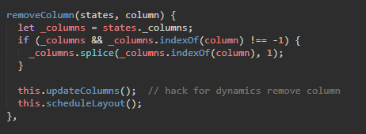
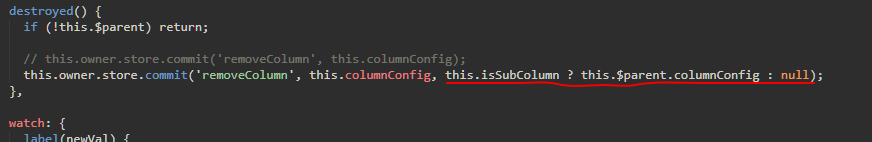
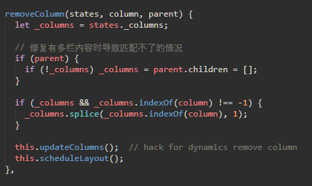
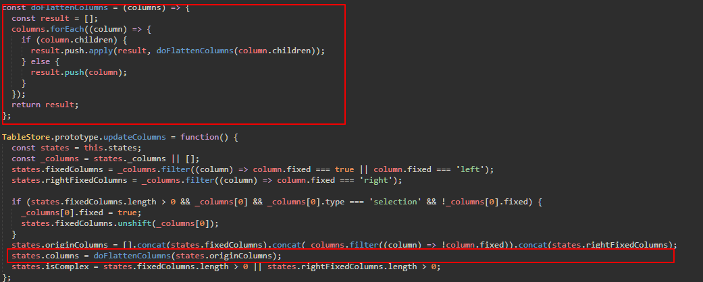

## 在多栏情况下，切换el-table-column，会保留之前的el-table-column。原因是在el-table-column移除时，没有判断是否是下栏的column(isSubColumn)。导致在removeColumn时，没有判断，只是indexOf(column)，导致无法删除。

## 修复方法如下：
table-column.js文件
判断是否是下级column,如果是传递this.$parent

table-store.js文件
通过parent是否是多栏情况，
如果是，直接把parent置[]，然后通过updateColumns方法中，因为parent.children = [],这样就可以把值删除了

